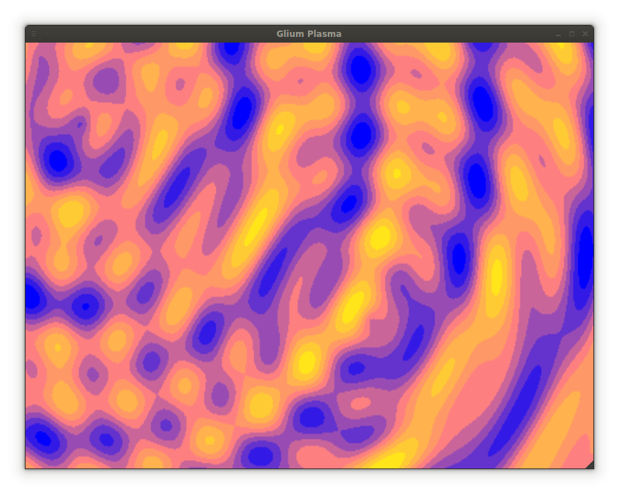

# GLium Plasma Effect #

An oldschool graphical plasma effect done in [Rust](https://www.rust-lang.org/)
with [Glium](https://github.com/tomaka/glium).
It's based on [this](https://rawgit.com/bwestlin/canvas-experiments/master/plasma.html)
which I made in JavaScript previously.

Here's how it looks:


Since the effect needs to manipulate pixels and Glium as an OpenGL wrapper
one way to do it is to manipulate the pixels of a texture and then draw the
texture on the screen. It's most likely not the most efficient way but still a way.

Example with a 2x2 texture:
```
let p_buffer = glium::texture::pixel_buffer::PixelBuffer::new_empty(&display, 4);
p_buffer.write(&[
    (255u8, 0u8, 0u8, 255u8),
    (0u8, 255u8, 0u8, 255u8),
    (0u8, 0u8, 255u8, 255u8),
    (255u8, 255u8, 255u8, 255u8)
  ]);
let texture = glium::texture::Texture2d::empty(&display, 2, 2).unwrap();
texture.main_level().raw_upload_from_pixel_buffer(p_buffer.as_slice(), 0 .. 2, 0 .. 2, 0 .. 1);
texture.as_surface().fill(&target, glium::uniforms::MagnifySamplerFilter::Linear);
```
For full example see: [main.rs](src/main.rs)

## Running ##

It need rust 1.5.0 (beta) or later. Suggestion is to use
[Multirust](https://github.com/brson/multirust) for setting up the Rust toolchain.


How to run with Multirust:
```
multirust override beta
cargo run
```

## Licence ##

Licensed under the Apache License, Version 2.0 (the "License"); you may not use this project except in compliance with the License. You may obtain a copy of the License at http://www.apache.org/licenses/LICENSE-2.0.

Unless required by applicable law or agreed to in writing, software distributed under the License is distributed on an "AS IS" BASIS, WITHOUT WARRANTIES OR CONDITIONS OF ANY KIND, either express or implied. See the License for the specific language governing permissions and limitations under the License.

Copyright &copy; 2015- Björn Westlin.
